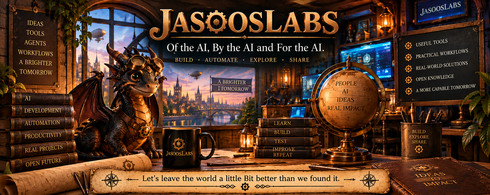

# JasoosLabs

## Of the AI, By the AI and For the AI.

JasoosLabs is an independent software studio exploring practical ways to make AI, automation, and everyday computing more useful.

The emphasis is not AI for its own sake. We build tools, workflows, experiments, and learning material intended to turn emerging technology into things people can actually use.

**Build • Automate • Explore • Share**

---

## What We Build

JasoosLabs projects explore areas such as:

- AI-assisted software development
- agentic AI workflows
- human-in-the-loop AI
- reusable workflow automation
- developer productivity
- Windows utilities
- personal computing tools
- music and media technology
- practical experiments with emerging AI capabilities

Some projects become applications. Others become experiments, tutorials, reusable workflows, or research.

---

## NovaInsert

### Agentic AI, Simplified

**Structured AI Coding • Asynchronous Coding • Reusable Workflows • Hideout**

NovaInsert is a Windows tool for organizing work you repeatedly do with AI, development tools, applications, and information.

It provides reusable structures for prompts, commands, procedures, testing, verification, agent delegation, keyboard actions, and other recurring work.

For AI-assisted development, NovaInsert supports a different way of working:

**Prepare → Delegate → Leave → Return → Verify**

Rather than requiring continuous interaction with an AI coding session, work can be prepared and delegated, then reviewed when convenient.

NovaInsert also includes **Hideout** for protected reusable information that should remain separate from ordinary workflow material.

### Get NovaInsert

Current public downloads, documentation, and release notes are available in the **JasoosLabs Releases** repository:

https://github.com/jasoos-labs/releases

---

## Explore

JasoosLabs is also a place for experimentation.

Not every useful idea begins as a product.

We explore technologies, build probes, test assumptions, document what works and what does not, and turn useful discoveries into software or reusable knowledge.

The process matters as much as the finished application.

---

## Share

Useful work should be explainable.

JasoosLabs projects are accompanied, where practical, by guides, examples, demonstrations, and tutorials so that others can understand not only what was built, but how and why it works.

---

## Current Products

### NovaInsert

Windows productivity and AI-workflow software.

**Agentic AI, Simplified.**

More JasoosLabs projects will be published as they become ready for public use.

---

## JasoosLabs

**Of the AI, By the AI and For the AI.**

**Let's leave the world a little bit better than we found it.**